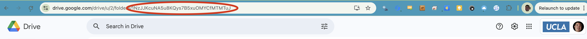

# Google Drive Scripts

These scripts 

## Mass Revoke Access From Secure Course Materials

At the close of the term, this script can be executed on a Google Drive folder to revoke all access.

Go to the main page for the directory where you wish to recursively revoke access and copy the end of the URL as in the image below.

1. Go to scripts.google.com, switch to the proper Google account.
2. Click on Create Project. 
3. Give the project a name.  
4. Copy the contents of revoke-access.js into the script editor.
5. Paste the folder ID into the main function the script as in the screenshot below.
6. Select the `main` function from the dropdown menu and click the Run button.

This will time out on large directories. Use with smaller directories and then iterate.
