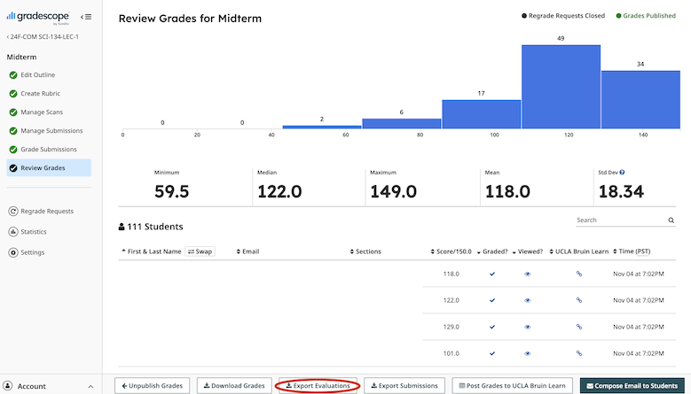

# Gradescope Exam Item Analysis

### Getting the Most from the Data

To get the most use out of this package, the following preconditions should be satisfied: 

* Each item should have a rubric item titled "No Response" (case insensitive).
* For analysis of groups of items in content clusters, process clusters, item types and other classifications, special tags must be added on the Statistics screen in Gradescope, for each item.
  * A *content cluster* is a group of items all related to the same topic or construct. Content clusters are indicated with tags of no particular format. (e.g. in a statistics class, all items related to testing the normal distribution should be tagged `normal`)
  * A *process cluster* is a group of items that are related to a specific thinking or problem solving process. Tags for process clusters start with `p`. For example, i an introductory math theory course, The process cluster "deductive reasoning" would be `p:deductive`.
  * Item types include free response (`type:free`), constructed response (`type:cr`), fill-in-the-blank (`type:fill`) multiple choice (`type:mc`), multiple selection (`type:ms`), true/false (`type:tf`).
  * You can create your own analysis categories/clusters by creating a custom tag. For example, to tag each item as a particular level of Bloom's taxonomy, you can create a tag with prefix `bloom`. An item assessing at the apply level would be tagged as `bloom:apply`.
* If a particular part of a problem uses multiple grading items, each item must be linked to the problem part either by indicating the specific problem/part ID at the beginning of the item description **or** the item number must be specified as a link tag.  For example, if problem 1(a) consists of two blanks, each forming a different Gradescope item, the name of both items should start with 1(a) **or** the tag link:1a or link:1(a) (they only need to be the same) must be included.

----

### Usage Instructions

From the **Review Grades** screen, click on **Export Evaluations**.

* Unzip the file containing the evaluations.
* Make a note of the path to the root of the unzipped directory containing the evaluations. Each item is in its own file.
* The columns for each item's file are: assignment ID, submission ID, question submission ID, first name, last name, SID, email, section(s), item score, submission time, *followed by a series of columns, one for each rubric item*, score adjustment, comments, grader name and tags.

